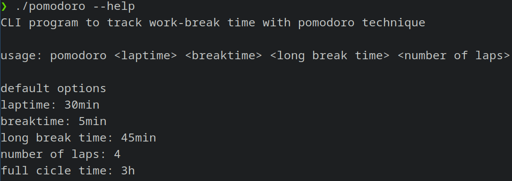
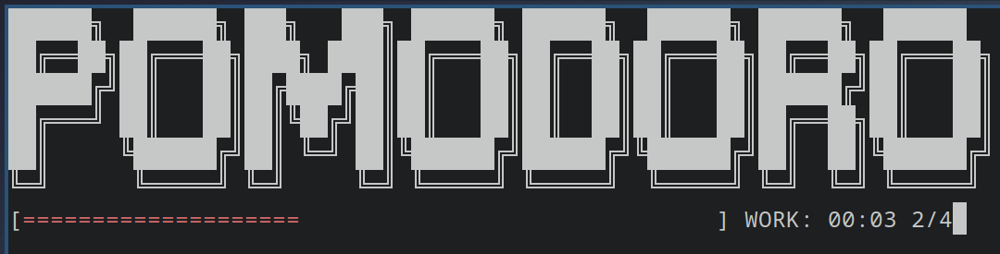
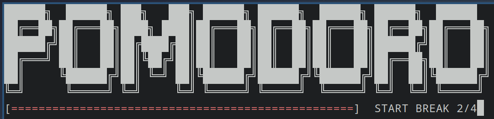
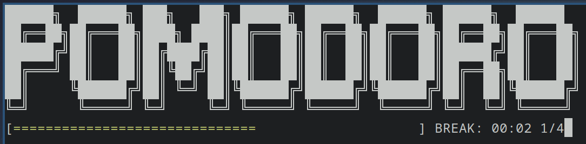
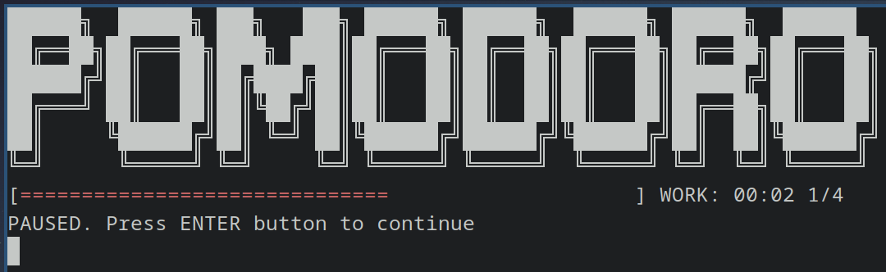

# Pomodoro CLI app

Simple cli program to track down work-break time with pomodoro system


## Installation

Clone repo and compite it with gcc

```bash
  git clone https://github.com/Namlev1/pomodoro
  cd pomodoro
  gcc pomodoro <-o custom_name>

```
    
## Demo

<p align="center">
  
<br>
  
<br>
  
<br>
  
<br>
  
<br>
  

  To pause, press enter.
</p>